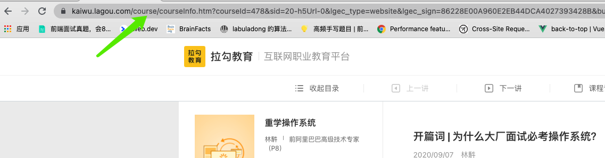
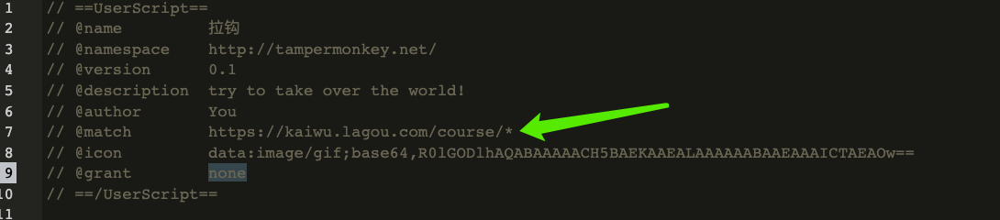
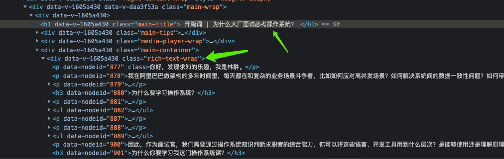

### 前言

当我们购买了某个专栏的内容的时候，发现其中文章写的很好，想保存下来。该如何操作呢？接下来，看看我这个菜鸟的操作！

### 环境准备

- Chrome 浏览器
- 油猴脚本管理器

### 油猴脚本的简单介绍

1. 专栏课中的url `kaiwu.lagou.com/course/......` 



2. 新建脚本文件中的match字段



油猴脚本管理器根据 match字段来匹配对应页面的 `url`, 自动初始化脚本。 在这里是一个正则，`*`的意思是后面是任意的字符。

```js
// @match        https://kaiwu.lagou.com/course/*
```


### 课程专栏的页面分析

根据**类选择器**拿到标签内的文本 。

- 标题 `.main-title`

- 内容`.main-wrap`

**核心API**

```js
const title = document.querySelector('.main-title').innerText
let content = document.querySelector('.main-wrap').innerText;
```




### 文件下载简单实现

```js
    function downLoadFile(content,fileName) {
        const link = document.createElement("a");
      	// 设置文件
        link.setAttribute('download', fileName);
        link.href = 'data:text/txt;charset=utf-8,\uFEFF'+ content
        document.body.appendChild(link);
        link.click();
        link.remove();
	}
```


[全部代码]: 

